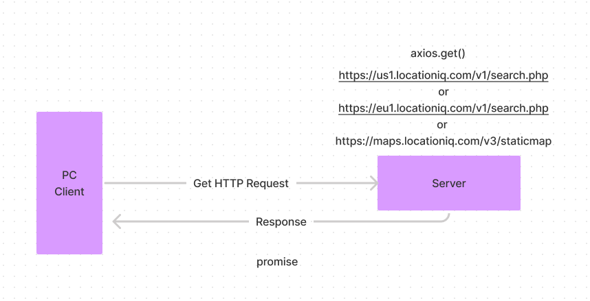
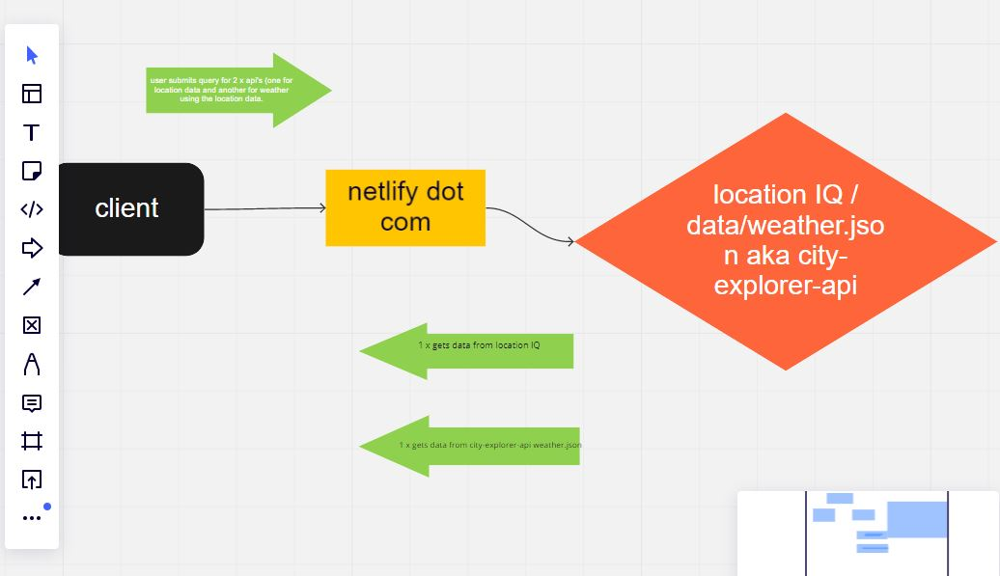

# City Explorer

**Author**: Harvey Lucas
**Version**: 1.0.0 (increment the patch/fix version number if you make more commits past your first submission)

## Overview

1. Allow a user to view latitude and lon for a specified city.
2. Render a map of the selected city.
3. Add weather data for selected city.

<!-- Provide a high level overview of what this application is and why you are building it, beyond the fact that it's an assignment for this class. (i.e. What's your problem domain?) -->

## Getting Started

<!-- What are the steps that a user must take in order to build this app on their own machine and get it running? -->

## Architecture

React.js
node.js





<!-- Provide a detailed description of the application design. What technologies (languages, libraries, etc) you're using, and any other relevant design information. -->

## Change Log

```

Name of feature: 7.3 Locations

Estimate of time needed to complete: 2 hours

Start time: 16:00

Finish time: 17:00

Actual time needed to complete: 1 hour

```

```

Name of feature: 7.2 Locations

Estimate of time needed to complete: 2 hours

Start time: 12:15

Finish time: 16:00 + 1day

Actual time needed to complete: 27:45

```

```

Name of feature: 6.2 Locations

Estimate of time needed to complete: 2 hours

Start time: 14:15

Finish time: 17:30

Actual time needed to complete: 3:15

```

```

Name of feature: 6.3 Map

Estimate of time needed to complete: 2 hours

Start time: 17:30

Finish time: 20:15

Actual time needed to complete: 2:45

```

```

Name of feature: 6.4 Errors

Estimate of time needed to complete: 2 hours

Start time: 20:45

Finish time: 21:30

Actual time needed to complete: :45

```

<!-- Use this area to document the iterative changes made to your application as each feature is successfully implemented. Use time stamps. Here's an example:

01-01-2001 4:59pm - Application now has a fully-functional express server, with a GET route for the location resource. -->

## Credit and Collaborations

Code Fellows

<!-- Give credit (and a link) to other people or resources that helped you build this application. -->
